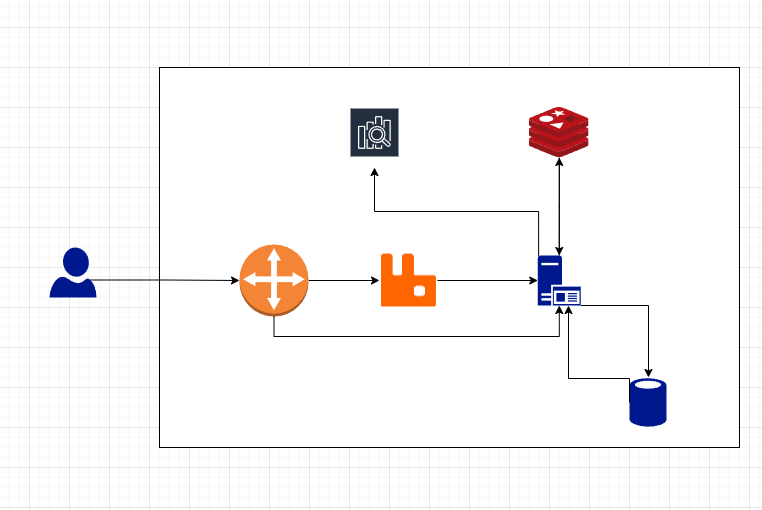

# API 명세서

## 잔액 조회

--- 
### ✅ API 개요
|메서드| URL                          |
|---|------------------------------|
|GET| /v1/users/`{userId}`/balance |

### 🟢 응답 (200 OK)
``` json
{
    "balance": 1000000
} 
```

### ❌ 에러 응답
#### 🔹404 Not Found
``` json
{
    "errorCode": "USER_NOT_FOUND",
    "errorMessage": "존재하지 않는 사용자 입니다."
} 
```

## 잔액 충전

---
### ✅ API 개요
|메서드| URL                          |
|---|------------------------------|
|POST| /v1/points/`{userId}`/charge |
### ✉️ Request Body
|이름|타입|설명|필수|
|---|---|---|--|
|balance|Integer|충전할 금액|✅|
### 🟢 응답 (200 OK)
``` json
{
    "balance": 1000000
}
```
|이름|타입|설명|
|---|---|---|
|balance|Integer|현재 보유 금액|

### ❌ 에러 응답
#### 🔹400 Bad Request
``` json
{
    "errorCode": "INVALID_REQUEST_PARAMETER",
    "errorMessage": "충전 금액은 0보다 커야 합니다."
}
```
#### 🔹404 Not Found
``` json
{
    "errorCode": "USER_NOT_FOUND",
    "errorMessage": "존재하지 않는 사용자 입니다."
} 
```

## 상품 리스트 조회

---
### ✅ API 개요
|메서드| URL                         |
|---|-----------------------------|
|GET| /v1/products/search?name=사과 |
#### 🔹쿼리 파라미터
| 이름   | 타입     | 설명  | 필수 |
|------|--------|-----|-|
| name | String | 검색명 ||


### 🟢 응답 (200 OK)
``` json
{
    "products": [
        {
            "productId": 1,
            "productName": "사과 10kg",
            "price": 71900,
            "stock": 100
        },
        {
            "productId": 2,
            "productName": "바나나 1박스",
            "price": 23500,
            "stock": 100
        },
        ...
    ]
}
```


## 보유 쿠폰 목록 조회

---
### ✅ API 개요
|메서드| URL                                                      |
|---|----------------------------------------------------------|
|GET| /v1/users/`{userId}`/coupons?status=usable&page=1&size=5 |

#### 🔹쿼리 파라미터
| 이름     | 타입     | 설명                            | 필수 |
|--------|--------|-------------------------------|-|
| status | String | 쿠폰 상태 (usable, used, expired) ||
| page   | int    | 페이지 번호 (기본값 : 1)              ||
| size   | int    | 페이지당 개수 (기본값 : 10)            | |

### 🟢 응답 (200 OK)
``` json
{
    "page": 1,
    "size": 10,
    "totalPages": 2,
    "totalElements": 15,
    "coupons": [
        {
            "couponId": 1,
            "couponName": "10% 할인 쿠폰",
            "discountType": "PERCENT",
            "discountValue": 10,
            "status": "USABLE",
            "validFrom": "2025-09-01T00:00:00Z",
            "validTo": "2025-09-09T23:59:59Z"
        },
        {
            "couponId": 2,
            "couponName": "2000원 할인 쿠폰",
            "discountType": "FIXED",
            "discountValue": 2000,
            "status": "USABLE",
            "validFrom": "2025-09-01T00:00:00Z",
            "validTo": "2025-09-09T23:59:59Z"
        },
        ...
    ]
}
```

### ❌ 에러 응답
#### 🔹404 Not Found
``` json
{
    "errorCode": "USER_NOT_FOUND",
    "errorMessage": "존재하지 않는 사용자 입니다."
}
```

## 선착순 쿠폰 발급

---
### ✅ API 개요
| 메서드  | URL                               |
|------|-----------------------------------|
| POST | /v1/coupons/`{couponEventId}`/claim |


### ✉️ Request Body
|이름|타입|설명|필수|
|---|---|---|--|
|userId|long|쿠폰을 받을 사용자 ID|✅|


### 🟢 응답 (200 OK)
``` json
{
    "couponId": 1234,
    "couponName": "9월 신규 고객 이벤트 3000원 할인 쿠폰",
    "discountType": "FIXED",
    "discountValue": 3000,
    "validFrom": "2025-09-01T00:00:00Z",
    "validTo": "2025-09-09T23:59:59Z"
}
```

### ❌ 에러 응답
#### 🔹404 Not Found
``` json
{
    "errorCode": "USER_NOT_FOUND",
    "errorMessage": "존재하지 않는 사용자 입니다."
}
```
#### 🔹409 Conflict
``` json
{
    "errorCode": "ALREADY_CLAIMED_COUPON",
    "errorMessage": "해당 쿠폰은 이미 발급되었습니다."
}
```

#### 🔹410 Gone
``` json
{
    "errorCode": "COUPON_OUT_OF_STOCK",
    "errorMessage": "쿠폰 소량이 모두 소진되었습니다."
}
```

## 주문 및 결제

---
### ✅ API 개요
| 메서드  | URL        |
|------|------------|
| POST | /v1/orders |

### ✉️ Request Body
``` json
{
    "userId": 1,
    "orderItems": [
        {
            "productId": 1,
            "quantity": 1
        },
        {
            "productId": 2,
            "quantity": 2
        }
    ],
    "shippingAddress": "서울시 XXX",
    "couponId": 1234
}
```
| 이름                     |타입| 설명          |필수|
|------------------------|---|-------------|--|
| userId                 |long| 사용자 ID      |✅|
| orderItems[].productId |long| 상품 ID       |✅|
| orderItems[].quantity|int| 구매 수량       |✅|
| shippingAddress|String| 배송정보        |✅|
| couponId | long| 적용할 쿠폰 ID| |

### 🟢 응답 (200 OK)
``` json
{
    "orderId": "ASD123123",
    "totalAmount": 1000000,
    "discountAmount": 3000,
    "paidAmount": 997000,
    "orderAt": "2025-09-03T21:48:00Z"
}
```

### ❌ 에러 응답
#### 🔹400 Bad Request
``` json
{
    "errorCode": "OUT_OF_STOCK",
    "errorMessage": "선택하신 상품의 재고가 부족합니다."
}
```
#### 🔹402 Payment Required
``` json
{
    "errorCode": "PAYMENT_FAILED",
    "errorMessage": "결제에 실패했습니다."
}
```

#### 🔹409 Conflict
``` json
{
    "errorCode": "COUPON_ALREADY_USED",
    "errorMessage": "이미 사용한 쿠폰입니다."
}
```

### 🔹400 Bad Request
``` json
{
    "errorCode": "COUPON_EXPIRED",
    "errorMessage": "유효기간이 지난 쿠폰입니다."
}
```

## 상위 상품 조회

3일간 가장 많이 팔린 인기상품 5개 조회

---
### ✅ API 개요
| 메서드 | URL                  |
|-----|----------------------|
| GET | /v1/products/popular |

### 🟢 응답 (200 OK)
``` json
{
    "products": [
        {
            "productId": 1,
            "productName": "사과 10kg",
            "price": 71900,
            "stock": 100,
            "sales": 1000
        },
        {
            "productId": 2,
            "productName": "바나나 1박스",
            "price": 23500,
            "stock": 100,
            "sales": 800
        },
        ...
    ]
}
```


# ERD


# 인프라 구성도

